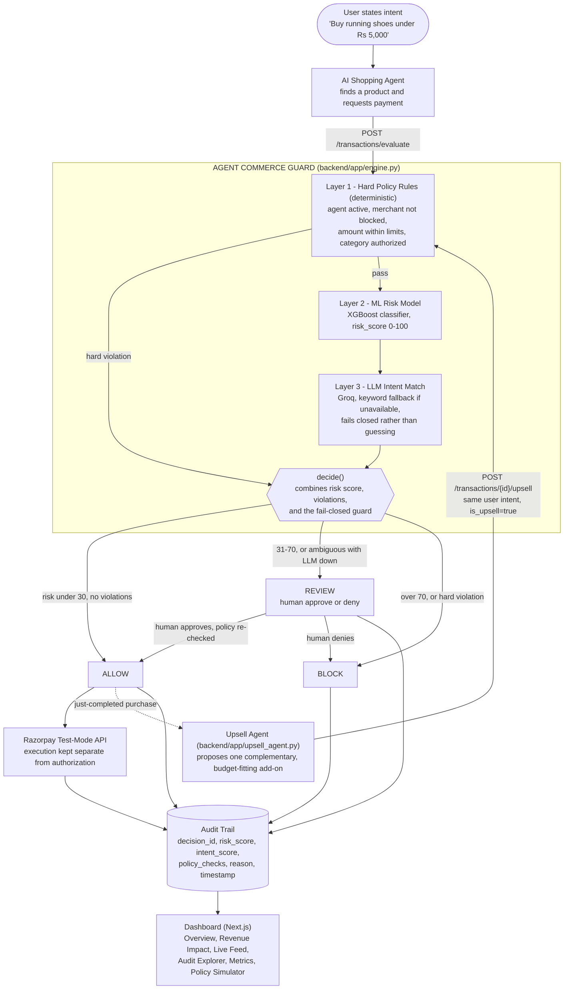

# Agent Commerce Guard

> Razorpay AI Buildathon 2026 — Track 01: AI Growth & Agentic Commerce
> The trust layer that lets AI agents spend money safely.

**Live demo:** [paywall-ai-orcin.vercel.app](https://paywall-ai-orcin.vercel.app)
**API:** [paywall-ai-backend.onrender.com/docs](https://paywall-ai-backend.onrender.com/docs)
**Repository:** [github.com/Lakshmikanth-3/PayWall.ai](https://github.com/Lakshmikanth-3/PayWall.ai)

---

## Table of Contents

- [Problem](#problem)
- [Architecture](#architecture)
- [Revenue growth vs. safety — one pipeline](#revenue-growth-vs-safety--one-pipeline)
- [Three-layer decision engine](#three-layer-decision-engine)
- [Quick start](#quick-start)
- [Environment variables](#environment-variables)
- [API reference](#api-reference)
- [Demo scenarios](#demo-scenarios)
- [Pre-seeded data](#pre-seeded-data)
- [Testing](#testing)
- [Dataset and evaluation](#dataset-and-evaluation)
- [Deployment](#deployment)
- [Tech stack](#tech-stack)
- [Known limitations](#known-limitations)

---

## Problem

AI agents are moving from recommending products to actually purchasing them for users. An agent that can complete a purchase can also be manipulated mid-checkout into paying for something the user never asked for, at a price they never approved.

Traditional fraud detection asks: *"Is this transaction fraudulent?"*

Agent Commerce Guard asks: *"Is this transaction authorized, consistent with the user's intent, within policy, and safe to execute?"*

The agent proposes a payment. The Guard authorizes it. Only an `ALLOW` (or a human-approved `REVIEW`) ever reaches Razorpay.

---

## Architecture



**Core principle:** the AI proposes, the Guard authorizes. The agent never receives unrestricted authority to move money.

---

## Revenue growth vs. safety — one pipeline

Section 2a of the product spec: the Guard alone only ever prevents loss. The **Upsell Agent** is what makes it a growth product too.

After an `ALLOW`ed purchase, it proposes one budget-fitting complementary item (running socks after running shoes, a charging cable after a phone). That proposal is evaluated by the **exact same Guard pipeline** as any other payment — same identity check, same intent match against the original user intent, same policy and risk layers. It has no special authority.

| Scenario | Example | Result |
|---|---|---|
| Legitimate upsell | Running socks, Rs 149, offered after a shoe purchase | `ALLOW` — counts as incremental GMV |
| Manipulated "upsell" | Protection plan, Rs 14,999, disguised as a checkout add-on | `BLOCK` — same code path, same reasons as any other unauthorized payment |

Both outcomes are tracked on the dashboard's **Merchant Revenue Impact** panel (`GET /dashboard/revenue-impact`): upsells proposed/allowed/blocked/reviewed, incremental GMV from allowed upsells, and exposure prevented from blocked ones.

---

## Three-layer decision engine

| Layer | Technology | Purpose |
|---|---|---|
| 1 — Hard Policy | Deterministic rules | Agent status, merchant blocklist, transaction/daily limits, category authorization |
| 2 — ML Risk Model | XGBoost, heuristic fallback | Risk score 0–100 from amount deviation, merchant risk, velocity, budget headroom |
| 3 — LLM Intent Match | Groq (OpenAI-compatible), keyword fallback | Does the payment match what the user actually asked for |

Layer 1 can short-circuit straight to `BLOCK`. Layers 2 and 3 always run and are combined by `app/engine.py::decide()`. If the LLM is unavailable, the fallback keyword scorer is treated as a degraded signal: the engine only auto-`ALLOW`s when the hard policy alone makes the transaction unambiguously safe (small amount, low-risk merchant, high keyword match); otherwise it downgrades to `REVIEW` rather than guessing. This fail-closed rule is exercised directly in the test suite and can be triggered live from the dashboard's "AI Reasoning" toggle.

| Risk score | Decision |
|---:|---|
| 0–30 | ALLOW |
| 31–70 | REVIEW |
| 71–100 | BLOCK |

Configurable via `ALLOW_THRESHOLD` / `REVIEW_THRESHOLD` env vars.

---

## Quick start

### Backend (FastAPI)

```powershell
cd backend
python -m venv venv
.\venv\Scripts\pip install -r requirements.txt

# Generate the synthetic dataset and train the risk model (first run only)
.\venv\Scripts\python scripts/generate_dataset.py
.\venv\Scripts\python scripts/train_model.py
.\venv\Scripts\python scripts/evaluate_dataset.py

# Seed demo agents, merchants, and transaction history
.\venv\Scripts\python scripts/seed_db.py

# Validate the PRD demo fixtures before presenting
.\venv\Scripts\python scripts/validate_fixtures.py

# Start the API (http://localhost:8000)
.\venv\Scripts\uvicorn app.main:app --reload
```

### Frontend (Next.js)

```powershell
cd frontend
npm install
npm run dev   # http://localhost:3000
```

The landing page is served at `/`; the working dashboard is at `/dashboard`.

---

## Environment variables

Create `backend/.env`:

```env
DATABASE_URL=sqlite:///./agent_guard.db   # default for local dev; Postgres in production
SECRET_KEY=change-me                      # also gates POST /admin/seed
GROQ_API_KEY=gsk_...                      # optional — enables live LLM intent matching
OPENAI_API_KEY=sk-...                     # optional fallback if GROQ_API_KEY is unset
RAZORPAY_KEY_ID=rzp_test_...              # optional — for real test-mode payment execution
RAZORPAY_KEY_SECRET=...
ALLOW_ORIGINS=http://localhost:3000
```

The system works without any LLM key configured — it falls back to deterministic keyword-based intent matching and fails closed to `REVIEW` for anything ambiguous. It also works without Razorpay credentials — payments are recorded as `SKIPPED` rather than blocking the decision.

For the frontend, set `NEXT_PUBLIC_API_URL` to the backend's URL (defaults to `http://localhost:8000`).

---

## API reference

| Method | Endpoint | Description |
|---|---|---|
| `POST` | `/agents` | Register an AI agent with a spending policy |
| `GET` | `/agents` | List all agents |
| `PATCH` | `/agents/{id}/suspend` \| `/activate` | Revoke or restore payment authority |
| `DELETE` | `/agents/{id}` | Permanently remove an agent and its transaction/audit history (test data cleanup — real agents should be suspended, not deleted) |
| `POST` | `/agents/{id}/simulate-policy` | Replay history against a proposed policy change |
| `POST` | `/merchants` | Register a merchant |
| `PATCH` | `/merchants/{id}/block` | Block a merchant |
| `DELETE` | `/merchants/{id}` | Permanently remove a merchant (test data cleanup — real merchants should be blocked, not deleted) |
| `POST` | `/transactions/evaluate` | Evaluate a payment request through the Guard |
| `GET` | `/transactions/{id}` | Fetch a transaction's full decision record |
| `POST` | `/transactions/{id}/review` | Human approve/deny a `REVIEW` transaction (re-checks policy) |
| `POST` | `/transactions/{id}/upsell` | Propose and evaluate an upsell for an `ALLOW`ed purchase |
| `POST` | `/transactions/{id}/retry-payment` | Retry a failed Razorpay call without re-authorizing |
| `GET` | `/dashboard/stats` | Aggregate statistics |
| `GET` | `/dashboard/metrics` | Precision/recall/F1/ROC-AUC and latency |
| `GET` | `/dashboard/revenue-impact` | Upsell Agent performance (Section 2a) |
| `GET` | `/dashboard/live` | Latest transactions |
| `GET` | `/dashboard/audit` | Searchable audit trail |
| `POST` | `/dashboard/llm-toggle` | Force the LLM offline to demo fail-closed behavior |
| `POST` | `/admin/seed` | Seed a deployed instance's own database (`X-Admin-Key: <SECRET_KEY>`; add `?force=true` to wipe and fully re-seed if a prior run was interrupted) |

Full interactive docs: `/docs` on whichever host you're running (local or the live API above).

---

## Demo scenarios

### Normal purchase — ALLOW

```json
{
  "agent_id": "AGT-001",
  "merchant_id": "MER-001",
  "amount": 4799,
  "category": "sports",
  "product": "Nike Running Shoes",
  "user_intent": "Buy running shoes under 5000"
}
```

Result: `ALLOW`. Risk score under 20, intent match at or above 0.90 (live LLM).

### Legitimate upsell — ALLOW

Proposed automatically via `POST /transactions/{shoes_txn_id}/upsell` after the purchase above:

```
Moisture-wicking Running Socks, Rs 149 — within the remaining daily budget
```

Result: `ALLOW`. Counts as incremental GMV on the Revenue Impact panel.

### Manipulated upsell (the killer scenario) — BLOCK

```json
{
  "agent_id": "AGT-001",
  "merchant_id": "MER-001",
  "amount": 14999,
  "category": "insurance",
  "product": "Premium Protection Plan",
  "user_intent": "Buy running shoes under 5000",
  "is_upsell": true
}
```

Result: `BLOCK`. Risk score above 70, intent match under 0.20, category not authorized for the agent. Reasons: amount exceeds the user's limit, product does not match user intent, category not authorized.

### Budget violation — BLOCK

Requesting more than an agent's remaining daily budget always blocks, regardless of merchant risk or intent match.

### Human review — REVIEW then approve

A medium-risk-merchant purchase lands in `REVIEW`. `POST /transactions/{id}/review` with `{"approved": true}` re-runs Layer 1 against current state (budget may have changed since the original decision) before calling Razorpay.

---

## Pre-seeded data

Created by `scripts/seed_db.py` (or `POST /admin/seed` on a deployed instance with no shell access).

### Agents

| ID | Name | Max transaction | Daily limit | Approval required above |
|---|---|---:|---:|---:|
| AGT-001 | Shopping Assistant | Rs 5,000 | Rs 10,000 | Rs 4,900 |
| AGT-002 | Travel Booker | Rs 20,000 | Rs 50,000 | Rs 10,000 |
| AGT-003 | Office Supply Agent | Rs 2,000 | Rs 5,000 | Rs 1,500 |

### Merchants

| ID | Name | Risk |
|---|---|---|
| MER-001 | Nike Official Store | LOW (8) |
| MER-002 | Amazon India | LOW (5) |
| MER-006 | QuickShop24 | MEDIUM (65) |
| MER-007 | ShadyDeals.in | HIGH (88) |
| MER-010 | SwiftGrocers | MEDIUM (35) |

---

## Testing

### Backend — pytest

100 tests, 89%+ overall coverage, 100% on the decision engine (`app/engine.py`). Runs fully offline against an in-memory database with the LLM and Razorpay calls disabled, so it never depends on external quota or network access.

```powershell
cd backend
.\venv\Scripts\pip install -r requirements-dev.txt
.\venv\Scripts\pytest tests/ -v --cov=app --cov-report=term-missing
```

Covers: Layer 1 policy checks, the `decide()` combiner (including the fail-closed path), the ML risk model, the keyword intent fallback, the Upsell Agent's budget-fitting logic, full `evaluate()` orchestration and persistence, and every API endpoint.

### Frontend — Playwright end-to-end

16 tests driven against the real running app (landing page, all eight dashboard routes, the killer-scenario `BLOCK`, a clean `ALLOW`, the upsell propose flow, and the LLM fail-closed toggle).

```powershell
cd frontend
npx playwright install chromium
npm run e2e
```

Requires the backend and frontend dev servers running locally (or set `E2E_BASE_URL` / `E2E_API_URL` to point elsewhere — the full suite also passes against the live Vercel + Render deployment linked above).

---

## Dataset and evaluation

`scripts/generate_dataset.py` produces a 7,000-row synthetic dataset at the hackathon-MVP scale, with an 80/20 train/holdout split:

| Scenario type | Rows |
|---|---:|
| Normal | 4,900 |
| Budget violation | 700 |
| Category violation | 350 |
| Intent mismatch | 350 |
| Suspicious merchant | 280 |
| Anomalous behavior | 210 |
| Velocity/duplicate | 140 |
| Mixed attack (includes manipulated-upsell rows) | 70 |

`scripts/evaluate_dataset.py` reports held-out metrics using the *same* `decide()` function the live engine uses — never a re-implementation that can drift. Because it never calls a live LLM, it doubles as a large-scale exercise of the fail-closed path: every holdout row is scored as if the LLM were permanently down. The current report (`backend/data/eval_report.json`) reflects that worst case — a real, honestly-reported number, not tuned toward a target. In normal operation with the LLM online (the default, and what `scripts/seed_db.py` and the live demo use), a much larger share of clean transactions resolve to `ALLOW` instead of the conservative `REVIEW` this holdout run shows.

The held-out set is never used to tune thresholds — only to report final numbers.

---

## Deployment

- **Frontend:** Vercel, deployed from `frontend/`. Set `NEXT_PUBLIC_API_URL` to the backend's public URL.
- **Backend:** Render, deployed via `render.yaml` (Blueprint) from the repo root, `rootDir: backend`. Uses a Render-managed Postgres instance rather than local SQLite, since Render's free-tier web services have an ephemeral filesystem that would otherwise wipe the database on every restart.
- **Seeding a deployed instance:** `POST /admin/seed` with header `X-Admin-Key: <SECRET_KEY>` runs the same seeding logic as the local `scripts/seed_db.py`, without needing shell or filesystem access.

---

## Tech stack

- **Frontend:** Next.js 16, TypeScript, Tailwind CSS, Framer Motion, Recharts
- **Backend:** Python, FastAPI, SQLAlchemy (SQLite for dev, PostgreSQL in production)
- **ML:** XGBoost with a deterministic heuristic fallback
- **AI:** Groq (OpenAI-compatible), with a keyword-based fallback that fails closed
- **Payments:** Razorpay Test Mode
- **Testing:** pytest, Playwright

---

## Known limitations

- Merchant risk signals are synthetic, as scoped for the buildathon.
- The held-out evaluation report reflects the LLM-unavailable worst case (see [Dataset and evaluation](#dataset-and-evaluation)) — live, LLM-enabled behavior differs and is what the actual demo and dashboard show.
- The Policy Simulator reuses each historical transaction's already-stored risk score rather than re-running the ML model against a proposed policy, since recomputing the original feature snapshot (e.g. merchant risk at that point in time) isn't preserved. Only the policy-dependent inputs (limits, categories, budget replay) are re-evaluated.
